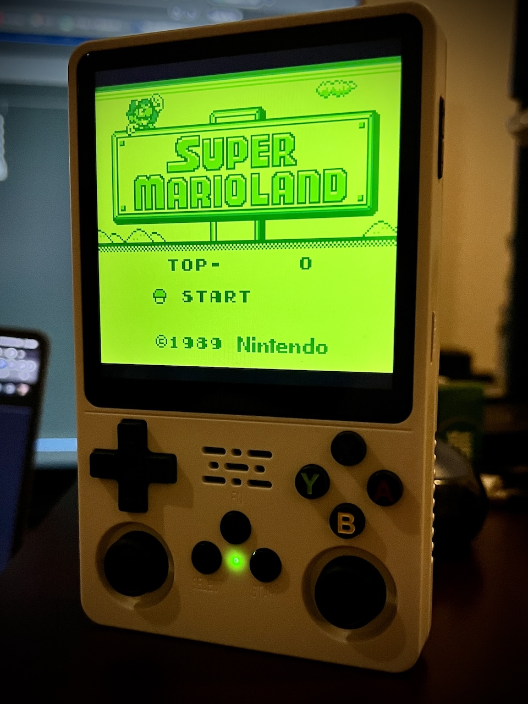

  
   
   


[Latest Version 0.1](https://github.com/game-de-it/plumOS-R36Plus/releases/tag/PlumOS-R36Plus_v0.1) 

---
# はじめに
[Click here for the English version of the explanation](./README_EN.md)

plumOS-R 36PlusはJELOS(StockOS)をベースに作られたCFWです。 


# 対応機種
- R36Plus

# ダウンロード
[「Releasesページ」からSDイメージファイルをダウンロードできます](https://github.com/game-de-it/plumOS-R36Plus/releases)

# 基本的な機能
- [pyxel](https://github.com/kitao/pyxel) が利用可能
- R36Plus用にチューニングされたイコライザー機能が利用可能
- Retroarch64bitおよび32bitの起動スクリプト修正
- Retroarchのホットキーを自由に設定可能
- picoarchが利用可能
- シンプルな外見のplumOS用のESテーマ(時刻が表示されます)
- ブランクSDカード挿入時の初期化処理の高速化
- BIOSがsquashfsに埋め込まれていたので完全に除去
- SSH接続のアカウント情報
  - ユーザ名は `root` 、パスワードは `plumos`


# pyxelについて
- `roms/pyxel`ディレクトリを作成してください
- 対応している拡張子は`.py`と`.pyxapp`
- オンラインアップデートを利用する場合はwifiに接続してEmulationstationの`Tools`セクションにある`pyxel_update`を実行します
- pythonモジュールを追加したい場合
  - 下記のシェルスクリプトの例を`roms/ports`ディレクトリに配置して、Emulationstationの`ports`セクションからこのスクリプトを実行します(全てのモジュールがインストールできるとは限りません)
    ```
    #!/bin/sh
    python3 -m pip install pygame --user
    ```

# OSのホットキー
| Button Combo | Action | 
|:-----------|------------:|
| SELECT+Vol+       |        画面輝度を上げる |
| SELECT+Vol-       |        画面輝度を下げる |


# picoarchについて
- SELECT＋STARTボタンでメニューが開きます
  - オプションメニューで設定を変更したら必ず「save config」をしてください
  - 設定項目によってはpicoarchの再実行が必要になります
- picoarchに関連するファイルやセーブデータは「/storage/.config/.picoarch/」に保存されます
- picoarch HDとLDの利用方法
  - エミュレーターセクション全体の設定  
    - ROM選択画面で「セレクトキー → システム詳細設定 → エミュレーター」の順に進み、「picoarch_HD」と「picoarch_LD」を選択します。 
  - ROMごとの設定  
    - ROMファイルにカーソルを合わせて"Xボタン" → "このゲームの詳細設定" → "エミュレーター"の順に進み、"picoarch_HD"と"picoarch_LD"を選択します。(エミュレーターセクション全体の設定よりもこの設定が優先されます)
- picoarch対応コア一覧  

| cores name | type | 
|:-----------|------------:|
| mednafen_ngp_libretro.so  | neogeo pocket(color) |
| smsplus-gx_libretro.so| gamegear,sms |
| gearsystem| gamegear,sms |
| picodrive_libretro.so | megadrive,gamegear,sms |
| Genesis-Plus-GX_libretro.so | megadrive,gamegear,sms |
| quicknes_libretro.so | nes,fds |
| fceumm_libretro.so | nes,fds |
| nestopia_libretro.so | nes,fds |
| beetle-pce-fast_libretro.so | pcengine(CD) |    
| gambatte_libretro.so | gb(color) |
| gpsp_libretro.so | gba |     
| mgba_libretro.so | gba |
| pcsx_rearmed_libretro.so  | psx |
| mednafen_wswan_libretro.so | wonderswan(color) |
| snes9x_libretro.so | snes |
| snes9x2010_libretro.so | snes |
| pokemini_libretro.so | pokemini |
| fmsx_libretro.so | msx |


- デフォルトのホットキー一覧

| Button Combo | Action | 
|:-----------|------------:|
| SELECT+START       |        picoarchメニュー表示 |
| SELECT+R       |        ステートセーブ |
| SELECT+L     |      ステートロード |


# Retroarchについて
- セーブファイル(.srm)はromファイルと同じフォルダに作成されます(変更可能)
- ステートセーブファイルはromファイルと同じフォルダに作成されます(変更可能)
- RetroArchのホットキー
  - ※Hotkeyの設定は自由に変更可能です

| Button Combo | Action | 
|:-----------|------------:|
| FunctionKey       |        Retroarchメニュー表示 |
| L3+R3      |        Retroarchメニュー表示 |
| SELECT+START       |        Retroarchの終了 |
| SELECT+R       |        ステートセーブ |
| SELECT+L     |      ステートロード |
| SELECT+R2     |      ファストフォワード(早送りx2倍) |
| SELECT+L2     |      スローモーション(x1.5倍) |
| SELECT+X     |      スナップショット(roms/screenshots) |
| SELECT+Y     |      FPS表示 |


# 各エミュレータのデータ保存場所
- セーブデータのバックアップなどをする際に参考にしてください

| Emulator | DIR | 
|:-----------|------------:|
| drastic       |        /storage/.config/drastic |
| ppsspp       |         /storage/.config/ppsspp |
| retroarch    |       各romディレクトリ内 |
| picoarch | /storage/.config/.picoarch/data |

以上
