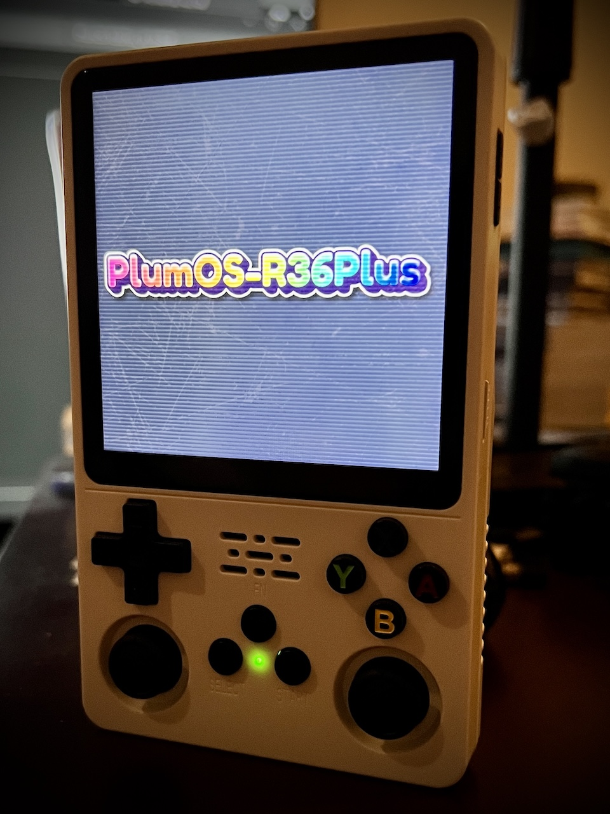
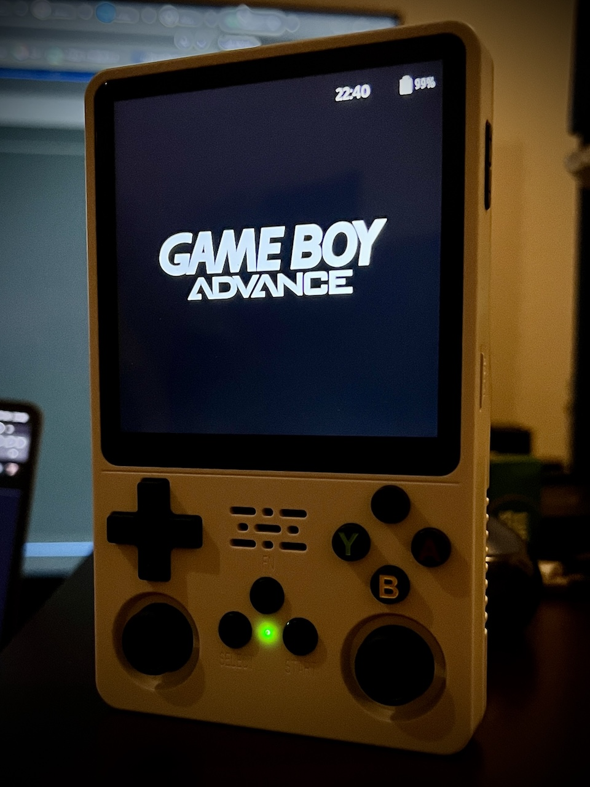
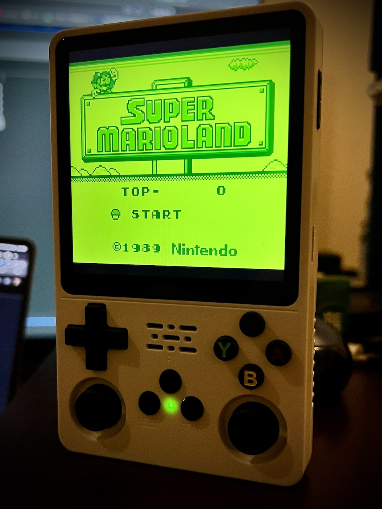
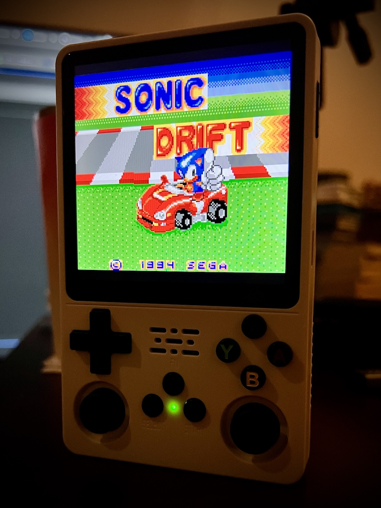

   
   

[Latest Version 0.1](https://github.com/game-de-it/plumOS-R36Plus/releases/tag/PlumOS-R36Plus_v0.1) 

---
# Introduction
[Click here for the English version of the explanation](./README_EN.md)

plumOS-R 36Plus is a custom firmware (CFW) based on JELOS (StockOS).

# Supported Device
- R36Plus

# Download
[You can download the SD image file from the "Releases" page](https://github.com/game-de-it/plumOS-R36Plus/releases)

# Main Features
- [pyxel](https://github.com/kitao/pyxel) support
- Custom equalizer tuned specifically for the R36Plus
- Startup script adjustments for both 64bit and 32bit versions of RetroArch
- Freely customizable hotkeys in RetroArch
- picoarch support
- Simple plumOS ES theme with clock display
- Faster initialization when inserting a blank SD card
- BIOS completely removed from embedded squashfs
- SSH account credentials
  - Username: `root`, Password: `plumos`

# About pyxel
- Create a directory named `roms/pyxel`
- Supported extensions are `.py` and `.pyxapp`
- To use the online update, connect to Wi-Fi and run `pyxel_update` from the `Tools` section in EmulationStation
- To add additional Python modules:
  - Place a shell script like the example below into the `roms/ports` directory and run it from the `ports` section of EmulationStation (Note: Not all modules may install successfully)
    ```
    #!/bin/sh
    python3 -m pip install pygame --user
    ```

# OS Hotkeys
| Button Combo | Action | 
|:-------------|--------|
| SELECT + Vol+ | Increase screen brightness |
| SELECT + Vol- | Decrease screen brightness |

# About picoarch
- Open the menu with SELECT + START
  - Be sure to "save config" after changing any settings in the options menu
  - Some settings may require restarting picoarch
- Files and save data related to picoarch are stored in `/storage/.config/.picoarch/`
- How to use picoarch HD and LD versions:
  - **System-wide settings**:  
    On the ROM selection screen, press the Select button → Advanced System Options → Emulator, and choose "picoarch_HD" or "picoarch_LD"
  - **Per-ROM settings**:  
    Highlight a ROM file and press "X Button" → "Advanced Game Options" → "Emulator", then choose "picoarch_HD" or "picoarch_LD". (This takes priority over system-wide settings.)

- Supported picoarch cores:

| Core Name | Type |
|:---------------------------|------------------------|
| mednafen_ngp_libretro.so  | Neo Geo Pocket (Color) |
| smsplus-gx_libretro.so    | Game Gear, SMS         |
| gearsystem                 | Game Gear, SMS         |
| picodrive_libretro.so     | Mega Drive, GG, SMS    |
| Genesis-Plus-GX_libretro.so | Mega Drive, GG, SMS |
| quicknes_libretro.so      | NES, FDS               |
| fceumm_libretro.so        | NES, FDS               |
| nestopia_libretro.so      | NES, FDS               |
| beetle-pce-fast_libretro.so | PC Engine (CD)       |
| gambatte_libretro.so      | Game Boy (Color)       |
| gpsp_libretro.so          | GBA                    |
| mgba_libretro.so          | GBA                    |
| pcsx_rearmed_libretro.so  | PS1                    |
| mednafen_wswan_libretro.so | WonderSwan (Color)    |
| snes9x_libretro.so        | SNES                   |
| snes9x2010_libretro.so    | SNES                   |
| pokemini_libretro.so      | Pokémon Mini           |
| fmsx_libretro.so          | MSX                    |

- Default Hotkeys

| Button Combo | Action |
|:-------------|--------|
| SELECT + START | Open picoarch menu |
| SELECT + R     | Save state |
| SELECT + L     | Load state |

# About RetroArch
- Save files (.srm) are stored in the same folder as the ROM file (can be changed)
- State save files are also stored in the same folder as the ROM file (can be changed)
- RetroArch Hotkeys  
  - *Hotkeys are fully customizable*

| Button Combo | Action |
|:-------------|--------|
| Function Key | Open RetroArch menu |
| L3 + R3      | Open RetroArch menu |
| SELECT + START | Quit RetroArch |
| SELECT + R     | Save state |
| SELECT + L     | Load state |
| SELECT + R2    | Fast forward (2x) |
| SELECT + L2    | Slow motion (1.5x) |
| SELECT + X     | Screenshot (saved in `roms/screenshots`) |
| SELECT + Y     | Toggle FPS display |

# Save Data Locations for Each Emulator
Use this info as a reference when backing up save data:

| Emulator | Directory |
|:---------|------------|
| drastic       | /storage/.config/drastic |
| ppsspp        | /storage/.config/ppsspp  |
| retroarch     | Within each ROM directory |
| picoarch      | /storage/.config/.picoarch/data |

That's all.
